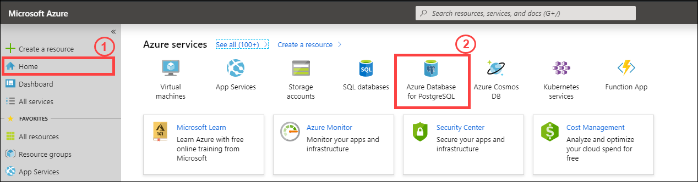
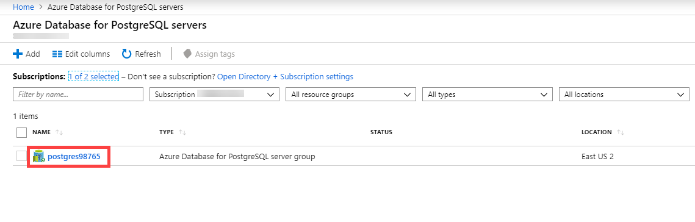

## Lab 1: Getting started with Hyperscale (Citus)

For a successfule connection into Hyperscale (Citus) on Azure Database for PostgreSQL, we need to enable firewall services.

### Task 1: Configure server-level firewall service

Follow the instructions given below to allow yourself access to the Hyperscale (Citus) server group.
 
1. Navigate to **Azure Portal**.

2. In the upper left of the Azure Portal go to **Home**, theb locate **Azure services** and select **Azure Database for PostgreSQL servers** on homepage.

<kbd></kbd>

3. Click on your PostgreSQL Database **postgreXXXXX**

<kbd></kbd>

4. On the left side navigation of the overview pane under **Security** click **Networking**. Put **Allow Azure Service** to **YES** and **save** the changes.

<kbd></kbd>

5. Click **Next** on the bottom right of this page.
