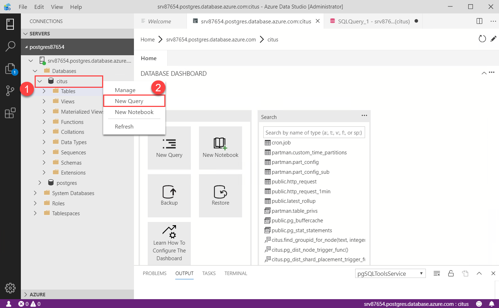
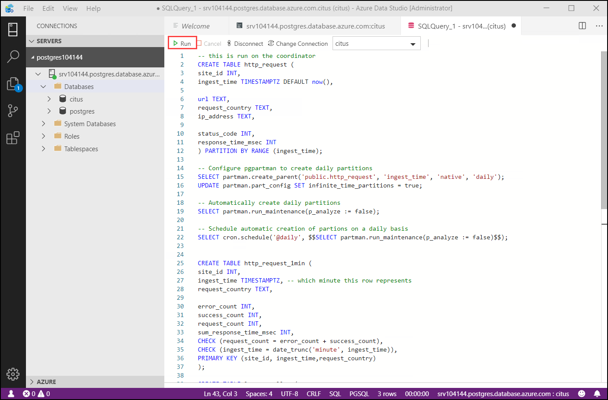
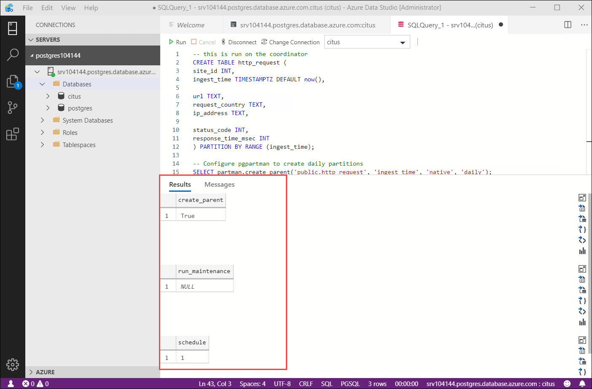
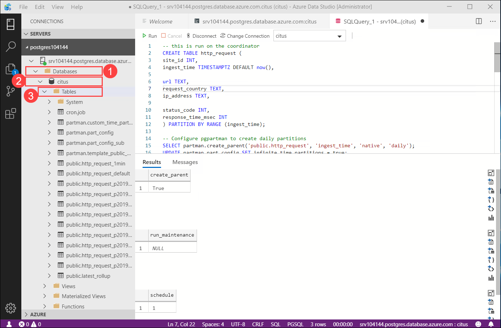
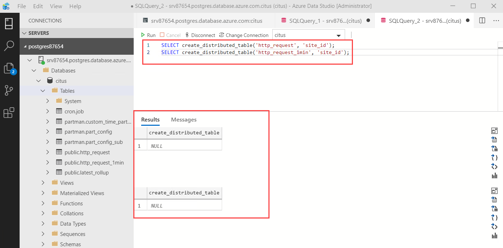

## **Lab 3: Create Application Tables**

The data we’re dealing with is an immutable stream of log data that we will be inserting directly into Hyperscale (Citus). It’s also common for log data to first be routed through something like Kafka. Kafka has many benefits like allowing you to pre-aggregate the data so high volumes of data are manageable.
On this page we will create a simple schema for ingesting HTTP event data, shard it, create load and then query.
Let's create the tables for http requests, per-minute aggregates and a table that maintains the position of our last rollup.

1.Expand the server group **postgresxxxxx**, then the server and under server expand **Database**. Right click on the database **citus** and select **New Query**.

<kbd></kbd>

2.In the **New Quer** copy and paste the following to create the tables.

```
-- this is run on the coordinator
CREATE TABLE http_request (
site_id INT,
ingest_time TIMESTAMPTZ DEFAULT now(),

url TEXT,
request_country TEXT,
ip_address TEXT,

status_code INT,
response_time_msec INT
) PARTITION BY RANGE (ingest_time);

-- Configure pgpartman to create daily partitions
SELECT partman.create_parent('public.http_request', 'ingest_time', 'native', 'daily');
UPDATE partman.part_config SET infinite_time_partitions = true;

-- Automatically create daily partitions
SELECT partman.run_maintenance(p_analyze := false);

-- Schedule automatic creation of partions on a daily basis
SELECT cron.schedule('@daily', $$SELECT partman.run_maintenance(p_analyze := false)$$);


CREATE TABLE http_request_1min (
site_id INT,
ingest_time TIMESTAMPTZ, -- which minute this row represents
request_country TEXT,

error_count INT,
success_count INT,
request_count INT,
sum_response_time_msec INT,
CHECK (request_count = error_count + success_count),
CHECK (ingest_time = date_trunc('minute', ingest_time)),
PRIMARY KEY (site_id, ingest_time,request_country)
);

CREATE TABLE latest_rollup (
minute timestamptz PRIMARY KEY,

CHECK (minute = date_trunc('minute', minute))
);
```

<kbd></kbd>

3.On running the query a message will be displayed: **Commands completed successfully**.

<kbd></kbd>

4.Verify the tables created by going to **Databases** > **citus** > **Tables**, under **Tables** you can review the tables. Along with tables you would also see daily partitions for the http_request table. We used pg_partman to create those partitions. pg_partman makes postgres native partitioning very simplified. We also scheduled a cron job to automatically create partitions on a daily basis.

<kbd></kbd>

### Shard tables across nodes

A hyperscale deployment stores table rows on different nodes based on the value of a user-designated column. This "distribution column" marks how data is sharded across nodes. Let's set the distribution column to be site_id, the shard key.

5.Now  select **New Query** as done before. Then copy and paste the following in the console to see what you just created. 

```
SELECT create_distributed_table('http_request', 'site_id'); 
SELECT create_distributed_table('http_request_1min', 'site_id'); 
```

<kbd></kbd>

The above commands create shards for both the tables across worker nodes. Shards are nothing but PostgreSQL tables that hold a set of sites. All the data for a particular site for a table will live in the same shard.

Notice that both tables are sharded on site_id. Hence there’s a 1-to-1 correspondence between http_request shards and http_request_1min shards i.e shards of both tables holding same set of sites are on same worker nodes. This is called colocation. Colocation makes queries, such as joins, faster and our rollups possible. In the following image you will see an example of colocation where for both tables site_id 1 and 3 are on worker 1 while site_id 2 and 4 are on Worker 2.

<kbd>

6.Click **Next** on the bottom right of this page.
