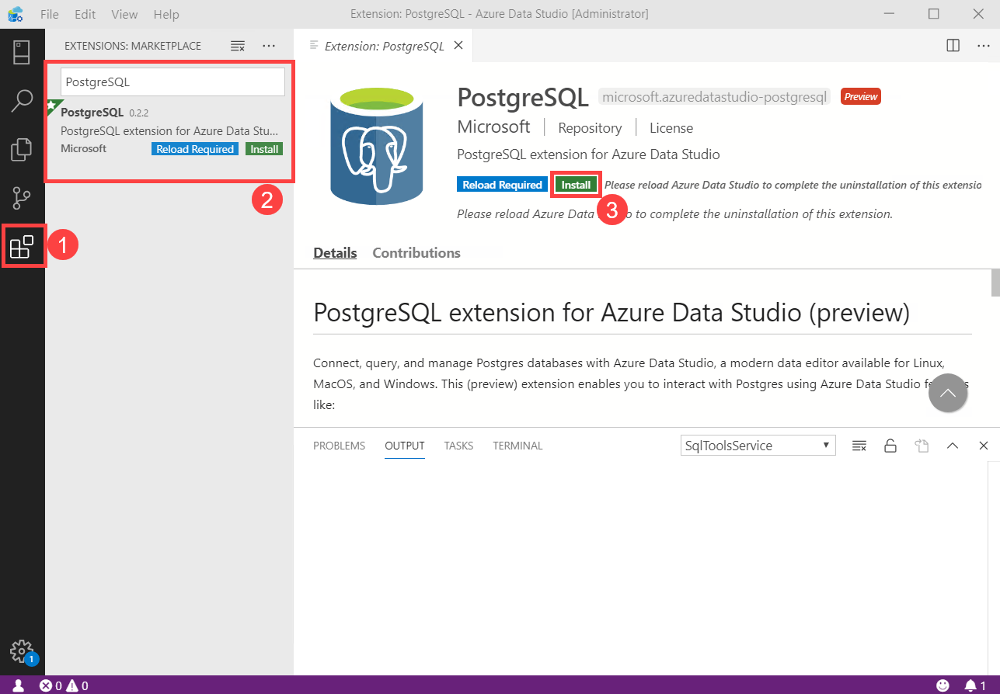
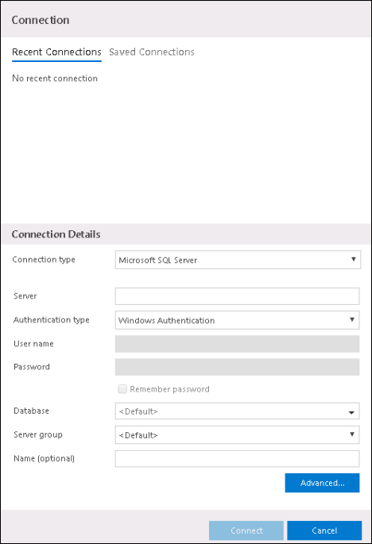
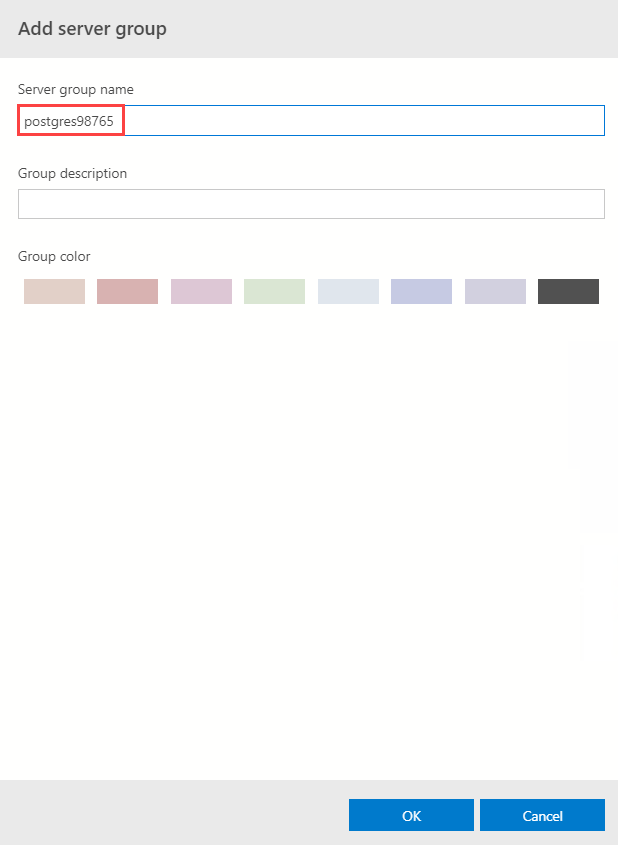
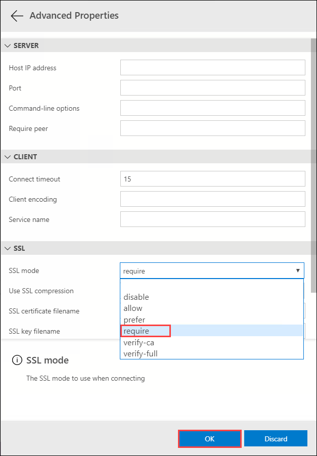
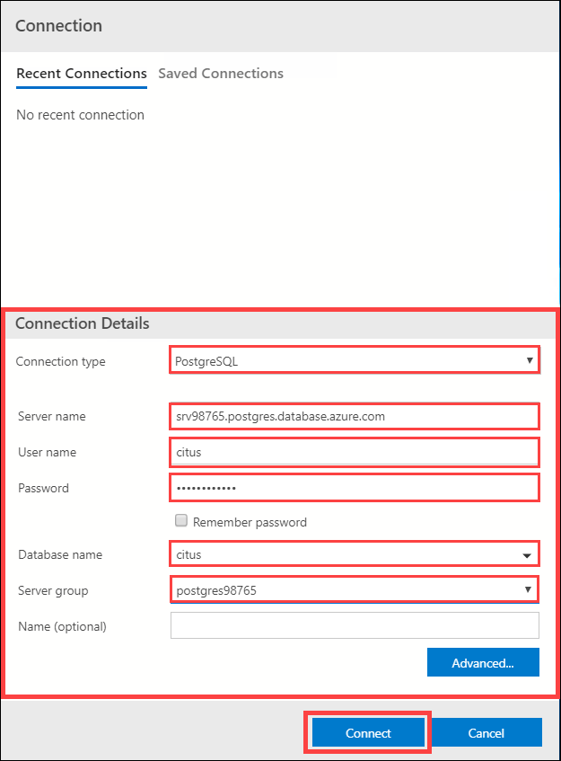
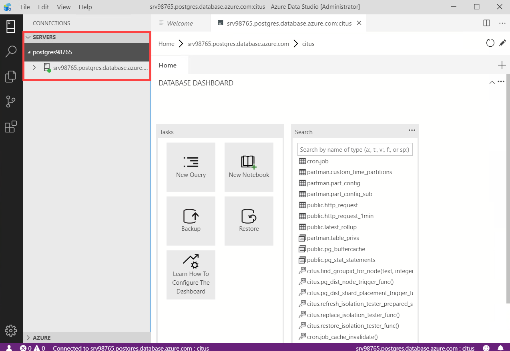

## **Lab 2: Connecting to Hyperscale (Citus) on Azure Database for PostgreSQL**

Here we will start working with Hyperscale (Citus) database using Azure Data Studio. First, We'll need to add firewall rules in Azure to allow access to the Hyperscale (citus) database.

### Task 1: Connect to the database using Azure Data Studio

Now we will connect to PostgreSQL Database through Azure Data Studio.

1.Open **Azure Data Studio** provided on the desktop. Select **No/Cancel** on any popup's at startup.

2.Then on the left click on **Extension** icon, then in the search bar enter **PostgreSQL** and select **Install**. After sucessful installation close and re-open the Azure Data Studio.

3.Now you will get **Connection** page to establish connection with the postgreSQL database.

4.Use following configurations for **Connection Details**:

* Connection type: select **PostgreSQL** from the dropdown.

Go to **Environment details** tab and copy following values from there:

* Server Name: Copy the server name given under **PostgreSQL Database hostname** in **environment details** tab.
* Username: **citus**
* Password: **Password.1!!**
* Database Name: **citus**
* Server Group: For server group name, select **Add server group** from the dropdown, Copy your server group name from **Environment details** tab and enter as shown below and select **OK**.

5.Then click on **Advanced** and configure **SSL Mode** to **require** from the dropdown and select **OK**.

6.Now **Connection details** should look similar to the below, then select **Connect**:

7.After getting connected, you can find your **PostgreSQL Database** under **Servers** blade as shown below:

8.Click **Next** on the bottom right of this page.
