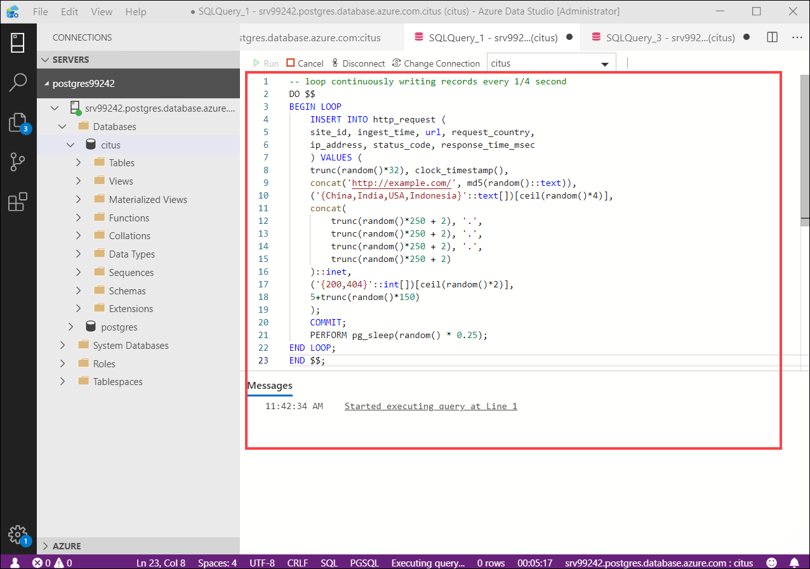
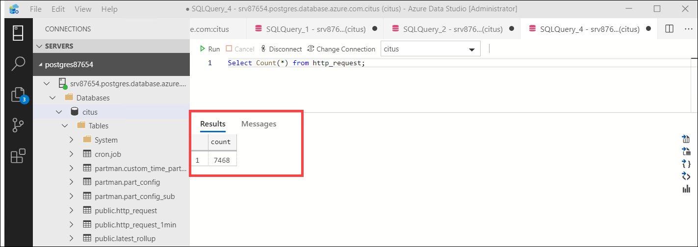
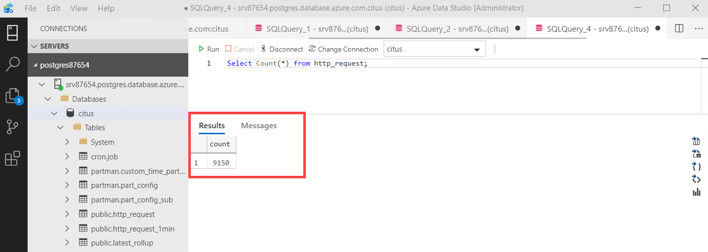
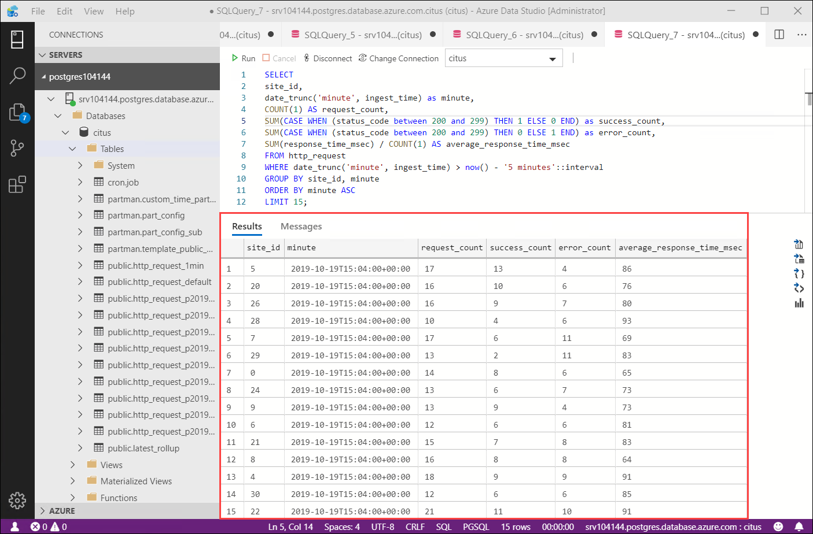

## **Lab 4: Generate data**

The system is ready to accept data and serve queries now! The next set of instructions will keep the following loop running in a Psql console in the background while you continue with the other commands in this article. It generates fake data every second or two.
 
1.Open **New Query** and paste the following query to create the http_request load generator.

```
-- loop continuously writing records every 1/4 second
DO $$
BEGIN LOOP
    INSERT INTO http_request (
    site_id, ingest_time, url, request_country,
    ip_address, status_code, response_time_msec
    ) VALUES (
    trunc(random()*32), clock_timestamp(),
    concat('http://example.com/', md5(random()::text)),
    ('{China,India,USA,Indonesia}'::text[])[ceil(random()*4)],
    concat(
        trunc(random()*250 + 2), '.',
        trunc(random()*250 + 2), '.',
        trunc(random()*250 + 2), '.',
        trunc(random()*250 + 2)
    )::inet,
    ('{200,404}'::int[])[ceil(random()*2)],
    5+trunc(random()*150)
    );
    COMMIT;
    PERFORM pg_sleep(random() * 0.25);
END LOOP;
END $$;
```

<kbd></kbd>

### Dashboard query

The Hyperscale (Citus) hosting option allows multiple nodes to process queries in parallel for speed. For instance, the database calculates aggregates like SUM and COUNT on worker nodes, and combines the results into a final answer.

2.Open **New Query** and enter the following command to verify the real-time load is being generated from the previous step.

```
Select Count(*) from http_request; 
```

<kbd></kbd>

3.Again open **New Query** and enter the select command once more to see that the count is increasing. You will observe an increase in the count.

```
Select Count(*) from http_request; 
```

<kbd></kbd>

4.We will run this query to count web requests per minute along with a few statistics. But now we are querying the rollup table instead of raw table.For this open **New Query**, then paste the following to see average response time for sites.

```
SELECT
site_id,
date_trunc('minute', ingest_time) as minute,
COUNT(1) AS request_count,
SUM(CASE WHEN (status_code between 200 and 299) THEN 1 ELSE 0 END) as success_count,
SUM(CASE WHEN (status_code between 200 and 299) THEN 0 ELSE 1 END) as error_count,
SUM(response_time_msec) / COUNT(1) AS average_response_time_msec
FROM http_request
WHERE date_trunc('minute', ingest_time) > now() - '5 minutes'::interval
GROUP BY site_id, minute
ORDER BY minute ASC
LIMIT 15;
```

<kbd></kbd>

5.The setup described above works but has drawbacks.
- Your HTTP operational analytics dashboard must go over each row every time it needs to generate a graph. For example, if your clients are interested in trends over the past year, your queries will aggregate every row for the past year from scratch.
- Your storage costs will grow proportionally with the ingest rate and the length of the queryable history. In practice, you may want to keep raw events for a shorter period of time (one month) and look at historical graphs over a longer time period (years).

5.Click **Next** on the bottom right of this page.
