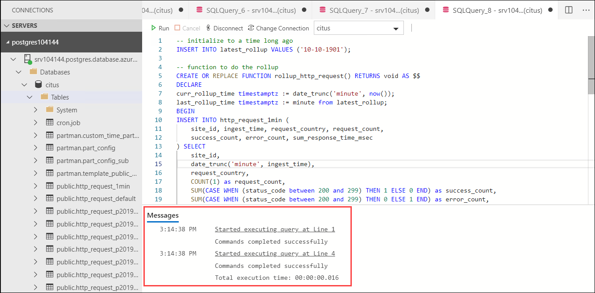
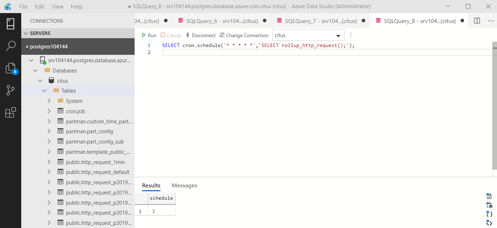
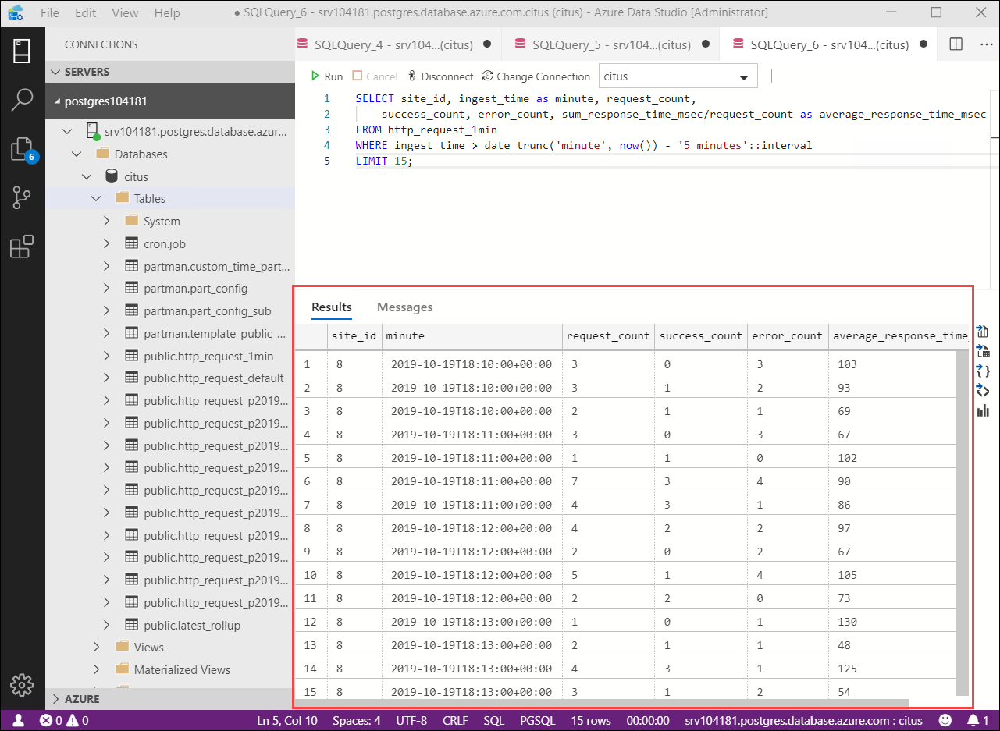

## **Lab 5: Create Rollup functions**

As your data scales we want to keep performance up. We will ensure our dashboard stays fast by regularly rolling up the raw data into an aggregate table. You can experiment with the aggregation duration. Here we will use a per-minute aggregation table, but you could break data into 5, 15, or 60 minutes instead.

To run this roll-up more easily, we're going to put it into a plpgsql function.

In order to populate http_request_1min we’re going to periodically run an **INSERT INTO SELECT ON CONFLICT DO UPDATE**. The **ON CONFLICT DO UPDATE** handles the late data use case i.e if your data arrives late to the database and there is already a row/aggregate for that minute then instead of inserting a new row, it would update that row  by taking into account the aggregates from late rows.
 
The above is very efficient because the tables are co-located. The following function wraps the rollup query up for convenience.


1.Open a **New Query** and paste the following to create the rollup_http_request function.

```
-- initialize to a time long ago
INSERT INTO latest_rollup VALUES ('10-10-1901');

-- function to do the rollup
CREATE OR REPLACE FUNCTION rollup_http_request() RETURNS void AS $$
DECLARE
curr_rollup_time timestamptz := date_trunc('minute', now());
last_rollup_time timestamptz := minute from latest_rollup;
BEGIN
INSERT INTO http_request_1min (
    site_id, ingest_time, request_country, request_count,
    success_count, error_count, sum_response_time_msec
) SELECT
    site_id,
    date_trunc('minute', ingest_time),
    request_country,
    COUNT(1) as request_count,
    SUM(CASE WHEN (status_code between 200 and 299) THEN 1 ELSE 0 END) as success_count,
    SUM(CASE WHEN (status_code between 200 and 299) THEN 0 ELSE 1 END) as error_count,
    SUM(response_time_msec) AS sum_response_time_msec
FROM http_request
-- roll up only data new since last_rollup_time
WHERE date_trunc('minute', ingest_time) <@
        tstzrange(last_rollup_time, curr_rollup_time, '(]')
GROUP BY 1, 2,3
ON CONFLICT (site_id,ingest_time,request_country)
DO UPDATE
    SET request_count = http_request_1min.request_count + excluded.request_count,
    success_count = http_request_1min.success_count + excluded.success_count,
    error_count = http_request_1min.error_count + excluded.error_count,
    sum_response_time_msec = http_request_1min.sum_response_time_msec + excluded.sum_response_time_msec;

-- update the value in latest_rollup so that next time we run the
-- rollup it will operate on data newer than curr_rollup_time
UPDATE latest_rollup SET minute = curr_rollup_time;
END;
$$ LANGUAGE plpgsql;
```

<kbd></kbd>

2.Open a **New Query**, then copy and paste the following to execute the rollup function.
```
SELECT rollup_http_request(); 
```

<kbd></kbd>


3.The above function should be called every minute. You could do this by using a PostgreSQL extension called pg_cron which allows you to schedule recurring queries directly from the database. Open **New Query** and paste the following and run.

```
SELECT cron.schedule('* * * * *','SELECT rollup_http_request();'); 
```

<kbd></kbd>

4.We will run a query to count web requests per minute. But now we are querying the rollup table instead of raw table. For this open **New Query**, then paste the following to see average response time for sites.

```
SELECT site_id, ingest_time as minute, request_count,
    success_count, error_count, sum_response_time_msec/request_count as average_response_time_msec
FROM http_request_1min
WHERE ingest_time > date_trunc('minute', now()) - '5 minutes'::interval
LIMIT 15;
```

<kbd></kbd>

### Expiring Old Data

The rollups make queries faster, but we still need to expire old data to avoid unbounded storage costs. Simply decide how long you’d like to keep data for each granularity, and use standard queries to delete expired data. 

- In the following example, we decided to keep raw data for one day, and per-minute aggregations for one month. You don't need to run these commands right now as we don't have any old data to expire.

```
DELETE FROM http_request WHERE ingest_time < now() - interval '1 day';
DELETE FROM http_request_1min WHERE ingest_time < now() - interval '1 month';
``` 

-  In production you could wrap these queries in a function and call it every minute in a cron job. Data expiration can go even faster by using latest time partitioning feature in PostgreSQL in addition to sharding with Hyperscale (Citus).

- You could also use extensions like pg_partman to automate time partition creation and maintenance. This helps you to directly drop partitions. This approach is more optimal than the DELETE command. We already did this for the raw (http_request) table. As an example, suppose the retention for the raw data is 3 days, you could DROP the partition(s) that are earlier than 3 days. In the below query, replace YYYY_MM_DD with the date that represents the 4th day prior to today. For example if today is 2019-11-04, YYYY_MM_DD would be 2019-10-31.

```
DROP TABLE http_request_pYYYY_MM_DD;
```

- You could also write a cron job using pg_cron to drop older partitions periodically. That way you can automate expiry.

Those are the basics! We provided an architecture that ingests HTTP events and then rolls up these events into their pre-aggregated form. This way, you can both store raw events and also power your analytical dashboards with subsecond queries.
The next sections extend upon the basic architecture and show you how to resolve questions which often appear.

5.Click **Next** on the bottom right of this page.
