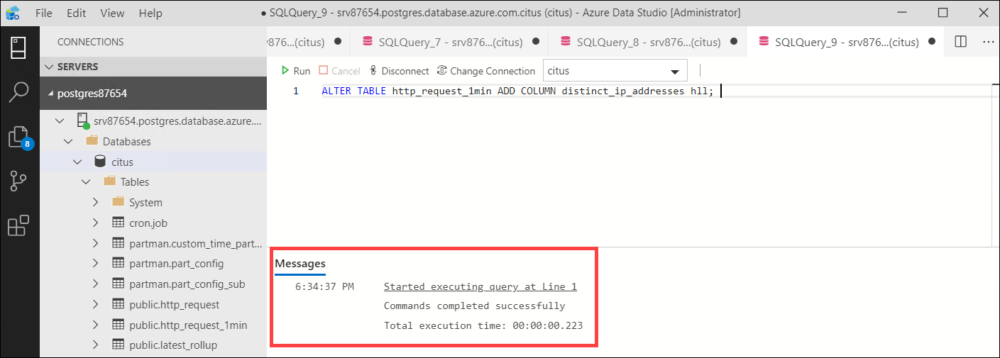
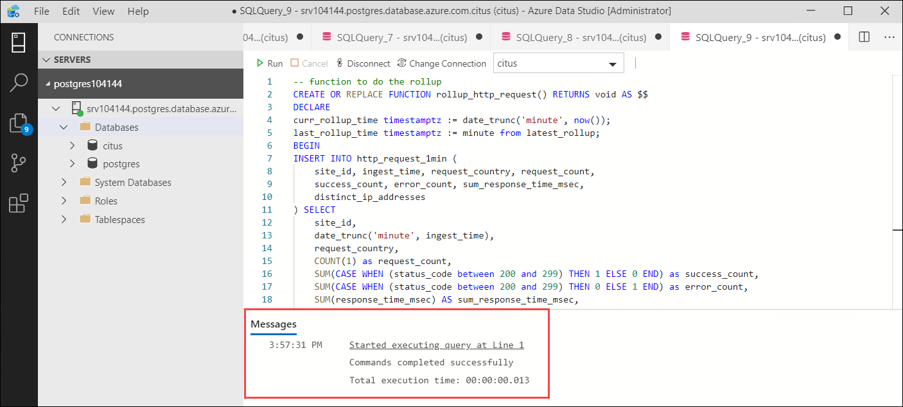
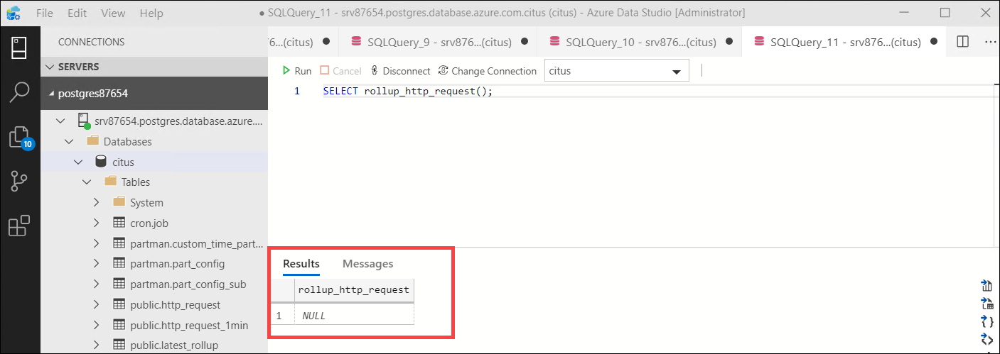
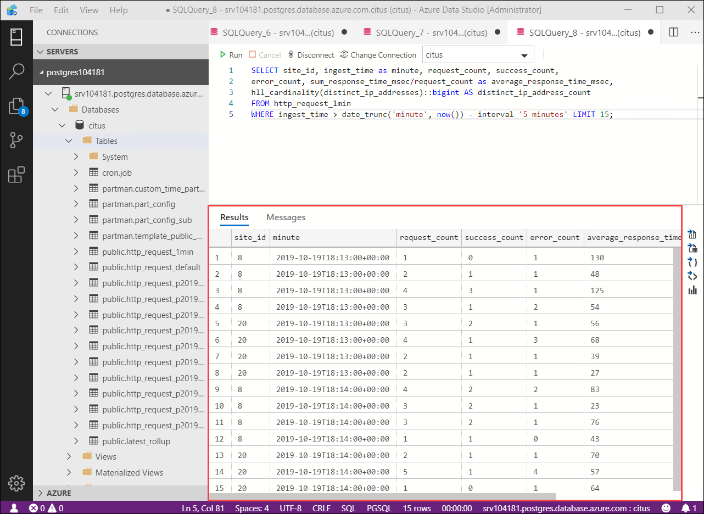
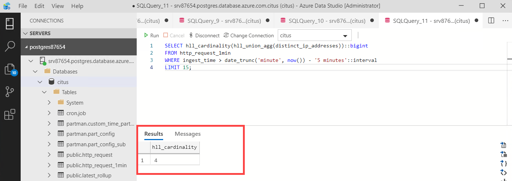
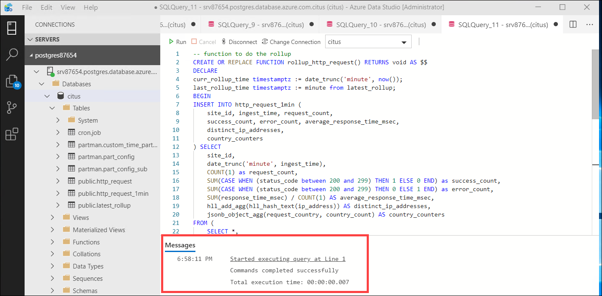
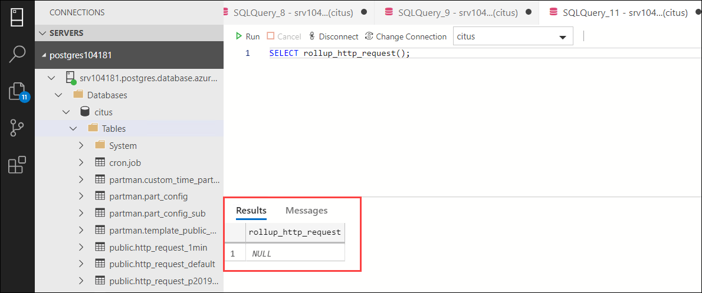
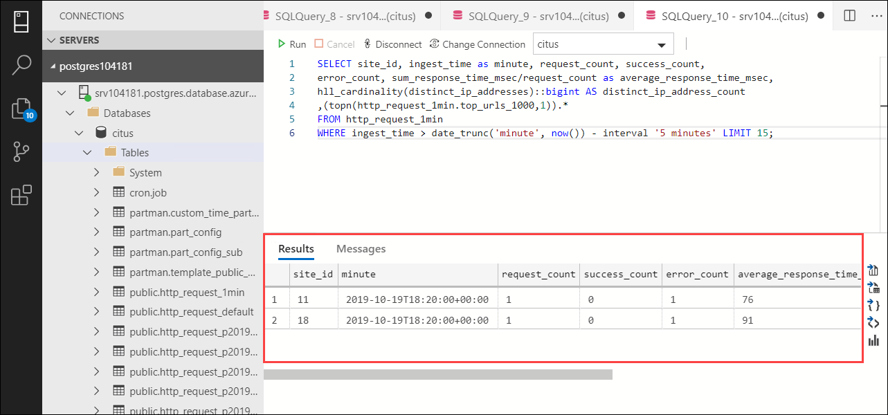
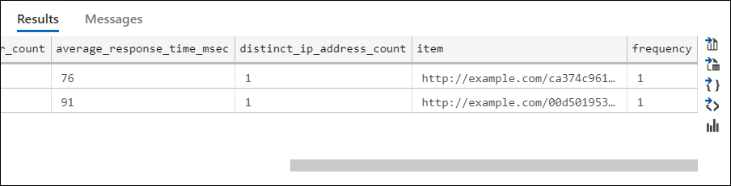
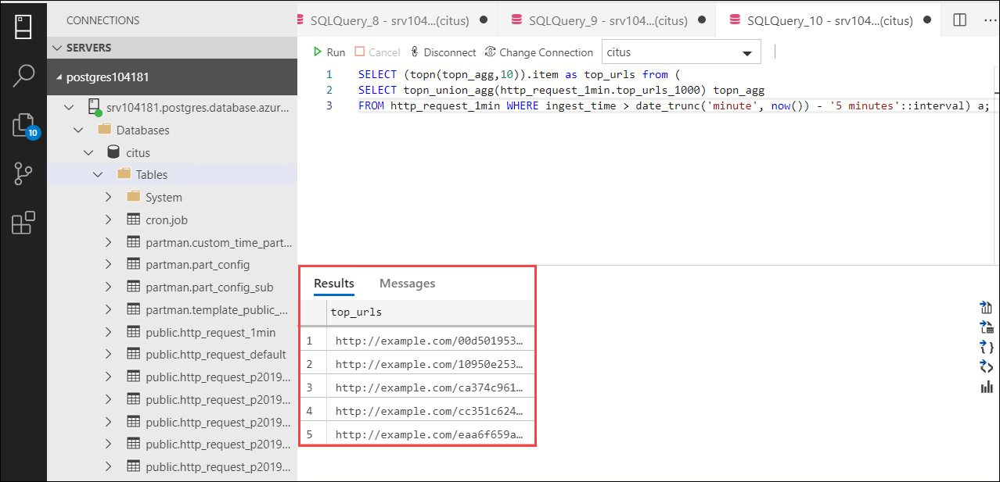

## **Lab 6: Approximate Distinct Counts**

A common question in HTTP operational analytics deals with approximate distinct counts: How many unique visitors visited your site over the last month? Answering this question exactly requires storing the list of all previously-seen visitors in the rollup tables, a prohibitively large amount of data. However an approximate answer is much more manageable.

A datatype called hyperloglog, or HLL, can answer the query approximately; it takes a surprisingly small amount of space to tell you approximately how many unique elements are in a set. Its accuracy can be adjusted. Without HLLs this query involves shipping lists of IP addresses from the workers to the coordinator for it to deduplicate. By using HLLs you can greatly improve query speed.

Hyperscale (Citus) already comes with HLL installed, along with other useful Extensions, which means that there are no manual steps to install/enable the HLL extension.

Now we’re ready to track IP addresses in our rollup with HLL. First add a column to the rollup table.

### Task 1: Track IP addresses in Rollup

 1.Open a **New Query** and paste the following. You will get a message that **Commands completed successfully**.

```
ALTER TABLE http_request_1min ADD COLUMN distinct_ip_addresses hll; 
```

<kbd></kbd>

2.Next we will use our custom aggregation to populate the column. Open a **New Query** and paste the following to add it to the query of our rollup function.

```
-- function to do the rollup
CREATE OR REPLACE FUNCTION rollup_http_request() RETURNS void AS $$
DECLARE
curr_rollup_time timestamptz := date_trunc('minute', now());
last_rollup_time timestamptz := minute from latest_rollup;
BEGIN
INSERT INTO http_request_1min (
    site_id, ingest_time, request_country, request_count,
    success_count, error_count, sum_response_time_msec,
    distinct_ip_addresses
) SELECT
    site_id,
    date_trunc('minute', ingest_time),
    request_country,
    COUNT(1) as request_count,
    SUM(CASE WHEN (status_code between 200 and 299) THEN 1 ELSE 0 END) as success_count,
    SUM(CASE WHEN (status_code between 200 and 299) THEN 0 ELSE 1 END) as error_count,
    SUM(response_time_msec) AS sum_response_time_msec,
    hll_add_agg(hll_hash_text(ip_address)) AS distinct_ip_addresses
FROM http_request
-- roll up only data new since last_rollup_time
WHERE date_trunc('minute', ingest_time) <@
        tstzrange(last_rollup_time, curr_rollup_time, '(]')
GROUP BY 1, 2,3
ON CONFLICT (site_id,ingest_time,request_country)
DO UPDATE
SET request_count = http_request_1min.request_count + excluded.request_count,
success_count = http_request_1min.success_count + excluded.success_count,
error_count = http_request_1min.error_count + excluded.error_count,
sum_response_time_msec = http_request_1min.sum_response_time_msec + excluded.sum_response_time_msec,
distinct_ip_addresses = hll_union(http_request_1min.distinct_ip_addresses,excluded.distinct_ip_addresses);

-- update the value in latest_rollup so that next time we run the
-- rollup it will operate on data newer than curr_rollup_time
UPDATE latest_rollup SET minute = curr_rollup_time;
END;
$$ LANGUAGE plpgsql;
```

<kbd></kbd>

The **INSERT INTO** statement now has **distinct_ip_addresses** and the **SELECT** now has **hll_add_agg(hll_hash_text(ip_address))** AS **distinct_ip_addresses** added into the **rollup_http_request** function. **hll_add_agg** populates the hll object with the distinct ip addresses. To handle the late data usecase, there is also **hll_union** operation that appends the newly created hll object to the already existing hll object.

3.Then open a **New Query** and paste the following to execute the updated function.

```
SELECT rollup_http_request(); 
```

<kbd></kbd>

4.Dashboard queries are a little more complicated, you have to read out the distinct number of IP addresses by calling the hll_cardinality function.

5.For this open a **New Query** and paste the following to create a report using the hll_cardinality function 

```
SELECT site_id, ingest_time as minute, request_count, success_count, 
error_count, sum_response_time_msec/request_count as average_response_time_msec, 
hll_cardinality(distinct_ip_addresses)::bigint AS distinct_ip_address_count 
FROM http_request_1min 
WHERE ingest_time > date_trunc('minute', now()) - interval '5 minutes' LIMIT 15;
```

<kbd></kbd>

HLLs aren’t just faster, they let you do things you couldn’t previously. Say we did our rollups, but instead of using HLLs we saved the exact unique counts. This works fine, but you can’t answer queries such as “how many distinct sessions were there during this one-week period in the past we’ve thrown away the raw data for?”.
With HLLs, this is easy. You can compute distinct IP counts over a time period with the following query
 
6.Open a **New Query** and paste the following to compute distinct IP counts over time.

```
SELECT hll_cardinality(hll_union_agg(distinct_ip_addresses))::bigint
FROM http_request_1min
WHERE ingest_time > date_trunc('minute', now()) - '5 minutes'::interval
LIMIT 15;
```

<kbd></kbd>

### Task 2: TopN for your Postgres Database

To find the top occurring item you generally need to count through all the records. Counting the clicks in your web app, the number of times you’ve listened to song, or the number of downloads of your project. It is all about counting. Counting, sorting, and limiting the list in Postgres is straightforward, and this works great on smaller sets of data. What if there are thousands of events? Machines these days are pretty fast so this isn’t much of a problem. Millions is even acceptable. Billions? That may take a bit longer. 

To solve the above problem you have the topN extension. TopN is an open source PostgreSQL extension that returns the top values in a database according to some criteria. TopN takes elements in a data set, ranks them according to a given rule, and picks the top elements in that data set. When doing this, TopN applies an approximation algorithm to provide fast results using few compute and memory resources.

The TopN extension becomes useful when you want to materialize top values, incrementally update these top values, and/or merge top values from different time intervals. you can think of TopN as hll’s cousin.

Hyperscale (Citus) already comes with TopN installed, which means that there are no manual steps to install/enable the TopN extension. Now we’re ready to track IP addresses in our rollup with TopN. First add a column to the rollup table.
 
1.Open a **New Query** and paste the following to add a new JSONB column top_urls_1000 to our rollup table. This stores the top 1000 urls for the minute and the site_id in the rollup table. You will get a message that **Commands completed successfully**.

> **NOTE:** PostgreSQL and Hyperscale (Citus) supports the jsonb data type to store unstructured json data. Postgres also provides rich indexing capabilities on the jsonb data type for fast search through the json object.

```
ALTER TABLE http_request_1min ADD COLUMN top_urls_1000 JSONB;
```

2.Now open a **New Query** and paste the following to add it to the query of our rollup function.

```
CREATE OR REPLACE FUNCTION rollup_http_request() RETURNS void AS $$
DECLARE
curr_rollup_time timestamptz := date_trunc('minute', now());
last_rollup_time timestamptz := minute from latest_rollup;
BEGIN
INSERT INTO http_request_1min (
    site_id, ingest_time, request_country, request_count,
    success_count, error_count, sum_response_time_msec,
    distinct_ip_addresses,top_urls_1000 
) SELECT
    site_id,
    date_trunc('minute', ingest_time),
    request_country,
    COUNT(1) as request_count,
    SUM(CASE WHEN (status_code between 200 and 299) THEN 1 ELSE 0 END) as success_count,
    SUM(CASE WHEN (status_code between 200 and 299) THEN 0 ELSE 1 END) as error_count,
    SUM(response_time_msec) AS sum_response_time_msec,
    hll_add_agg(hll_hash_text(ip_address)) AS distinct_ip_addresses,
    topn_add_agg(url::text) AS top_urls_1000
FROM http_request
-- roll up only data new since last_rollup_time
WHERE date_trunc('minute', ingest_time) <@
        tstzrange(last_rollup_time, curr_rollup_time, '(]')
GROUP BY 1, 2,3
ON CONFLICT (site_id,ingest_time,request_country)
DO UPDATE
SET request_count = http_request_1min.request_count + excluded.request_count,
success_count = http_request_1min.success_count + excluded.success_count,
error_count = http_request_1min.error_count + excluded.error_count,
sum_response_time_msec = http_request_1min.sum_response_time_msec + excluded.sum_response_time_msec,
distinct_ip_addresses = hll_union(http_request_1min.distinct_ip_addresses,excluded.distinct_ip_addresses),
top_urls_1000 = topn_union(http_request_1min.top_urls_1000, excluded.top_urls_1000);

-- update the value in latest_rollup so that next time we run the
-- rollup it will operate on data newer than curr_rollup_time
UPDATE latest_rollup SET minute = curr_rollup_time;
END;
$$ LANGUAGE plpgsql;
```

<kbd></kbd>

The **INSERT INTO** statement now has **top_urls_1000** and the **SELECT** now has **topn_add_agg(url::text)** AS **top_urls_1000** added into the **rollup_http_request** function. **topn_add_agg** adds top 1000 urls to the **top_urls_1000** jsonb column. To handle the late data usecase, there is also topn_union operation that appends the newly created topn/jsonb object to the already existing topn/jsonb object.

3.Open **New Query**, then copy and paste the following to execute the updated function.

```
SELECT rollup_http_request(); 
```

<kbd></kbd>

4.Now run Dashboard query to get the top urls per minute over the last 5 minutes. Open **New Query** and paste the following.
If you observe we query the top_urls_1000 column using the topn() function to get only the top most url per minute. 

```
SELECT site_id, ingest_time as minute, request_count, success_count,
error_count, sum_response_time_msec/request_count as average_response_time_msec,
hll_cardinality(distinct_ip_addresses)::bigint AS distinct_ip_address_count
,(topn(http_request_1min.top_urls_1000,1)).*
FROM http_request_1min
WHERE ingest_time > date_trunc('minute', now()) - interval '5 minutes' LIMIT 15;
```



You can scroll and check the whole table as shown below:

<kbd></kbd>

5.Open **New Query**, then copy and paste the following to create a report for the top 10 urls in the last 5 minutes. If you observe the query uses topn_union_agg to aggregate the minutely topn values over the last 5 minutes.

```
SELECT (topn(topn_agg,10)).item as top_urls from (
SELECT topn_union_agg(http_request_1min.top_urls_1000) topn_agg 
FROM http_request_1min WHERE ingest_time > date_trunc('minute', now()) - '5 minutes'::interval) a; 
```

<kbd></kbd>

6.Click **Next** on the bottom right of this page.
