## **Lab 7: Dashboarding on Hyperscale (Citus) using Power BI**

Using Power BI, you get the ability to centralize your data, simplify it with queries you create, and share it in highly visual reports. Power BI has both direct query and import support for PostgreSQL i.e you can both generate reports that directly run queries/aggregates on the database or by pulling and caching data in Power BI. These features work with both Single Server and Hyperscale (Citus) deployment options for Azure Database for PostgreSQL.

In real-time analytics workloads, you can use Power BI to query both rollup tables and raw tables in Hyperscale (Citus). With larger datasets you could use the direct query functionality for better scalability. Because of sharding and parallelism across multiple nodes dashboard queries would be super snappy. For smaller datasets you could use the import functionality to create reports. Along with performance, Hyperscale (Citus) also lets you have large number of users concurrently running reports in Power BI.
 
In this exercise, you will connect to your PostgreSQL database cluster in Power BI Desktop and view/create advanced visualizations:

1.Open **PowerBI** given in left side on the desktop. A welcome page will open where you have to select **Already have PowerBI account?Sign in**.

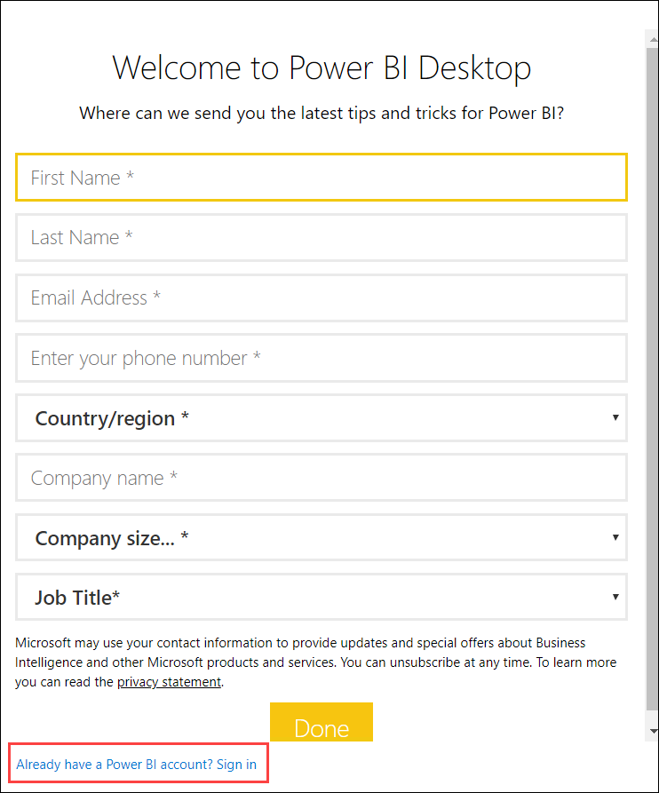

2.Now provide your **Username** as shown below:

 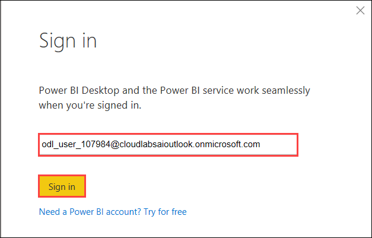

Then enter **Password** to successfully sign in.

 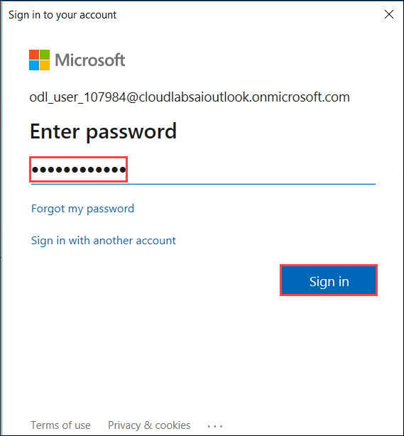

3.Now select **Get Data** as shown below:

 

4.A **Get Data** block will appear. Select **Database** > **PostgreSQL database** and then **Connect**.

 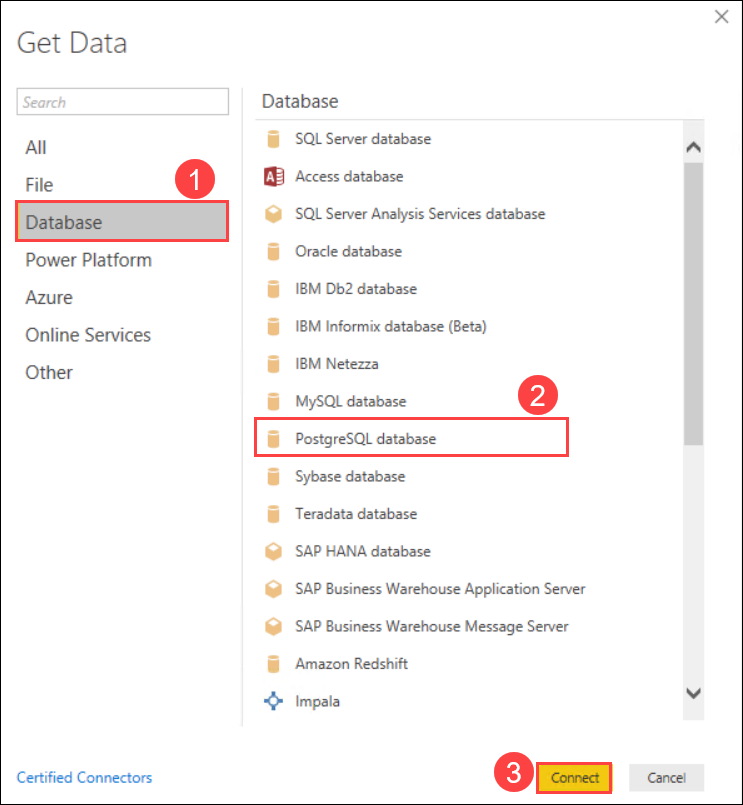

5.Now connect to the database by providing your **Server name** and **Database name** (copy both from environment details tab). For **Data Connectivity Mode** select **Direct query**. Then select **Ok**.

 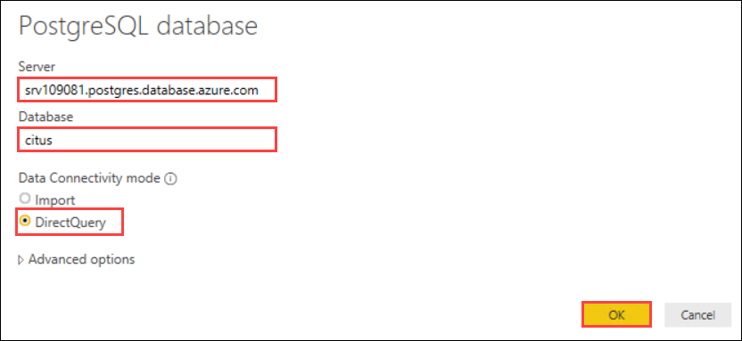

6.Now in the **Navigator** select **public.http_request_1min** table given under the server and select **Load**.

 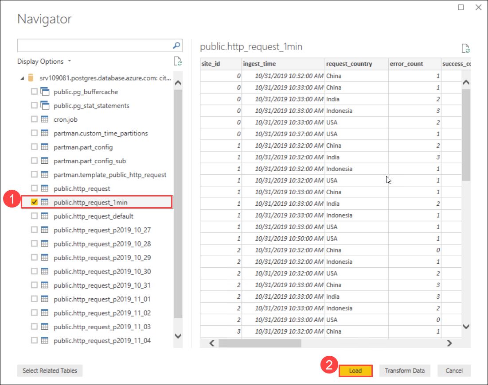

7.Then in the right hand side in PowerBI, review the table you selected in the previous step under **Fields**.

 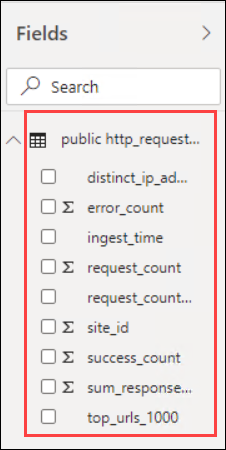

8.Now select **Clustered Column Chart** as shown below. Then drag **site_id** under **Axis**.

 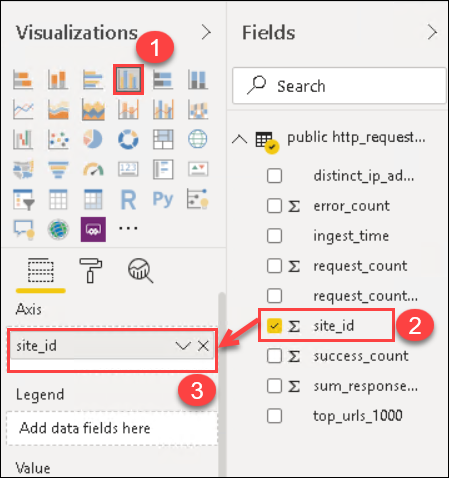

9.Now drag **error_count**, **request_count** and **success_count** under **Value** as shown below:

 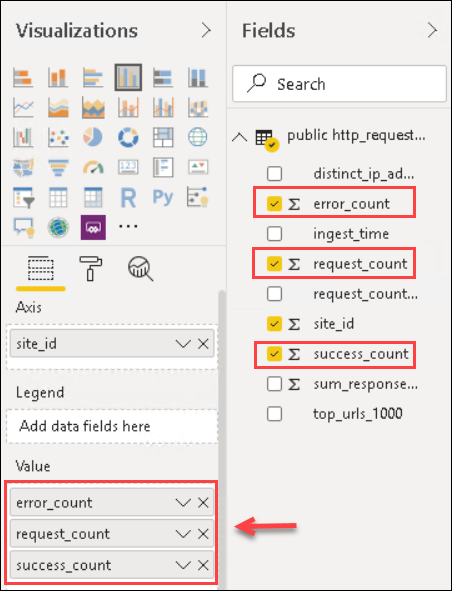

10.Now add filter by dragging **ingest_time** under **Filters on this page**.

 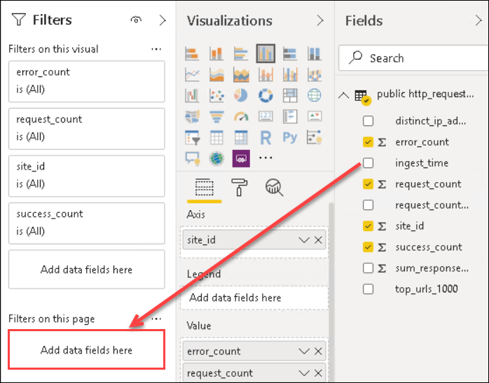

11.It will look like as shown below. Then select **Filter Type** as **Basic Filtering** from the dropdown.

 

12.Now select a randome ingest time as shown below.

 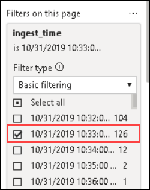

13.The final graph will look similar to the one shown below.

 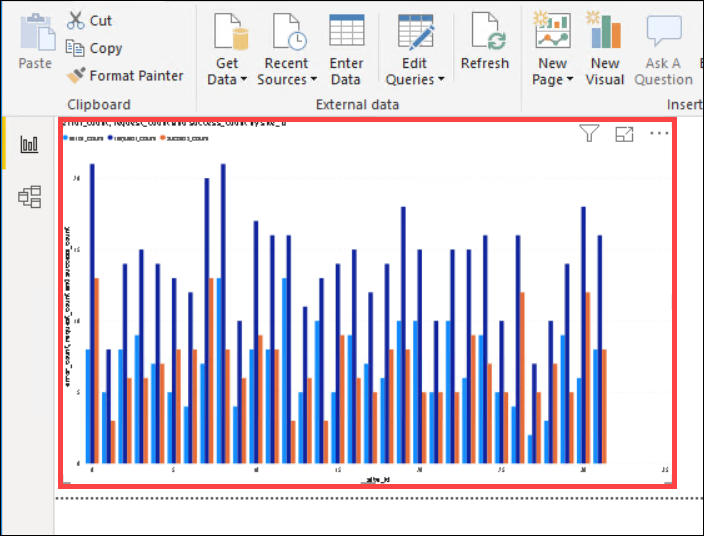

You can explore more on the PowerBI Dashboard to visualize the data. As a reference, we've another PowerBI dashboard draft file saved on desktop which includes a more comprehensive pre-built PowerBi dashboard for the same data. Let's take a look at that:

15.Now Open file **Real-Time-Data-Analytics-Draft** given on the VM desktop. You will get a security popup, select **Ok** there.

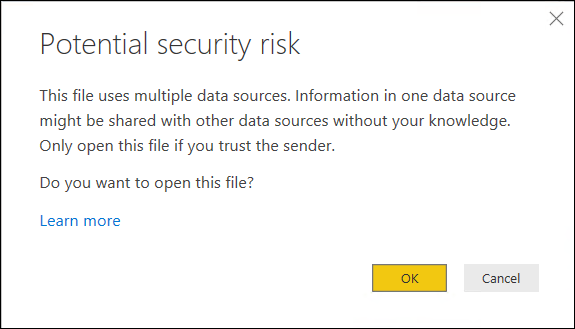

16.Then input the following credentials for database connection:

* **server (host)name:** select **ignite-2019-c.postgres.database.azure.com** from the dropdown
* **username:** citus
* **password:** demo123!

Then select **Connect**.

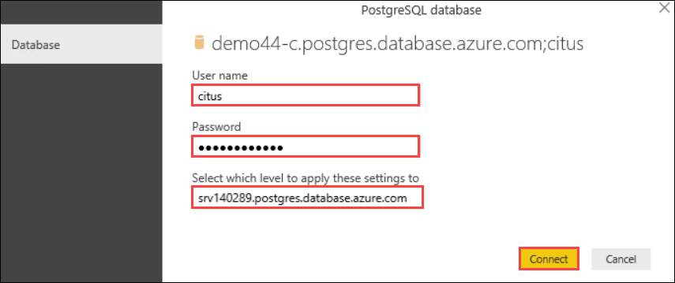

17.Now select **Ok** for **Welcome to ArcGIS Maps for PowerBI** popup. Also, select **Got it** for the popup- **Introducing the new filter blade**.

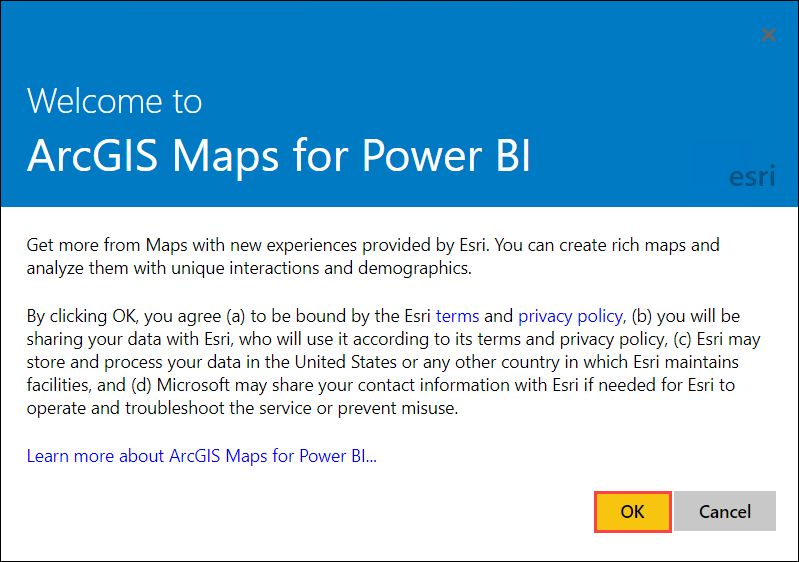

18.This will direct you to the PowerBI Report.

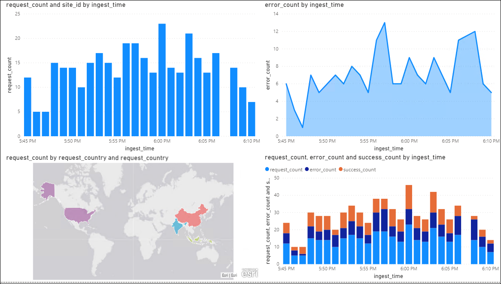

20.You can explore the dasboard and report configuraton here. 

21.Click **Next** on the bottom right of this page.
