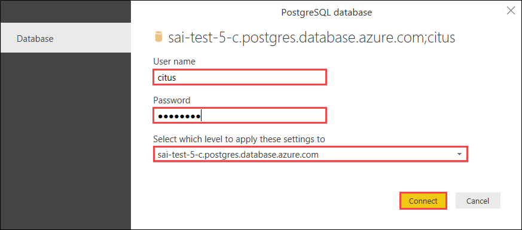
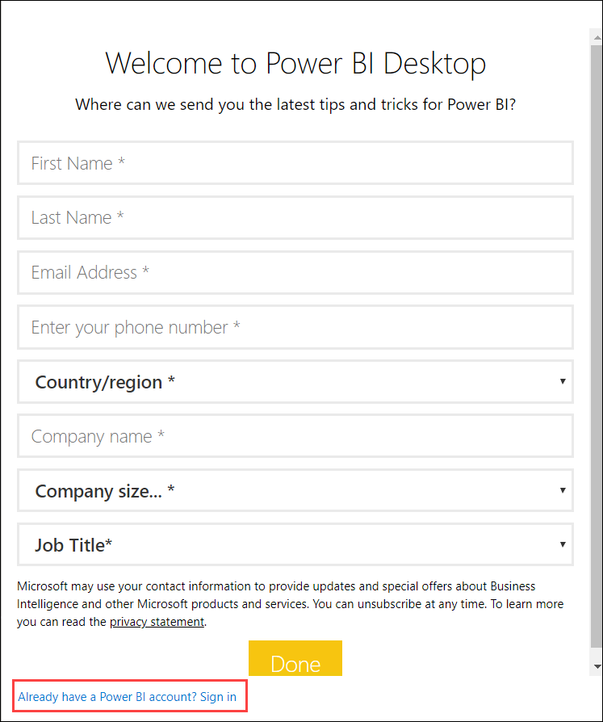
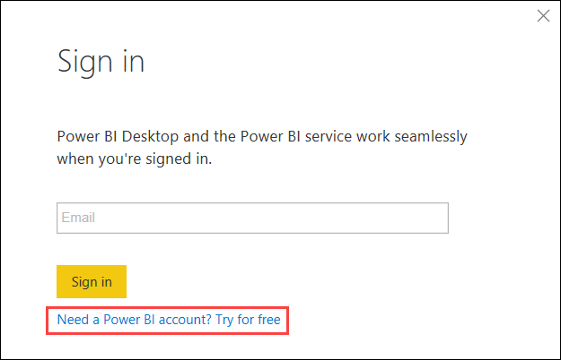
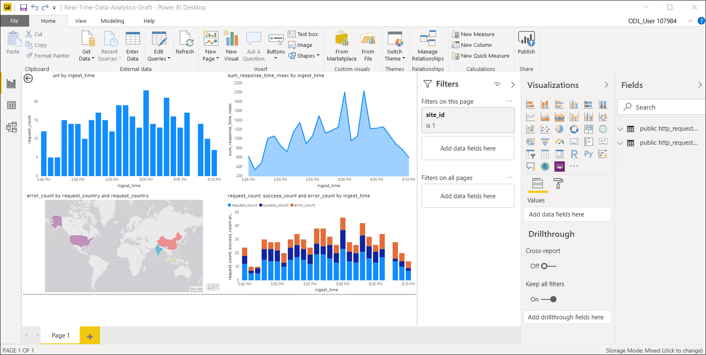

## **Lab 7: Dashboarding on Hyperscale (Citus) using Power BI**

You can use Power BI to analyze and visualize your PostgreSQL data. Using Power BI, you get the ability to centralize your data, simplify it with queries you create, and share it in highly visual reports. Power BI has both direct query and import support for PostgreSQL i.e either you can generate reports that directly run queries/aggregates on the database or by pulling and caching data in Power BI. These functionalities should work with both Single Server and Hyperscal (Citus) options of Azure Database for PostgreSQL.
 
In real-time analytics workloads, you can use Power BI to query both rollup tables and raw tables in Hyperscale (Citus). With larger datasets you could use the direct query functionality for better scalability. Because of sharding and parallelism across multiple nodes dashboard queries would be super snappy. For smaller datasets you could use the import functionality to create reports. Along with performance, Hyperscale (Citus) also lets you have large number of users concurrently running reports in Power BI.
 
In this exercise, you will connect to your PostgreSQL database cluster in Power BI Desktop and view/create advanced visualizations:

1.Open file **Real-Time-Data-Analytics-Draft** given on the VM desktop. You will get a security popup, select **Ok** there.

2.Then input the following credentials for database connection:
* **server (host)name:** sai-test-5-c.postgres.database.azure.com
* **username:** citus
* **password:** test123!

Then select **Connect**.

3.Now select **Ok** for **Welcome to ArcGIS Maps for PowerBI** popup. Also, select **Got it** for the popup- **Introducing the new filter pane**.

4.You will see a **sign in** box. Select Sign in option given at bottom.

5.Then in sign in box select **Need a PowerBI account?Try for free.**. This will open PowerBI sign in page in your browser.

6.Use your credentials which you have to copy from the **Environment detials** tab. Copy username and password and paste for signing in. You will get a popup saying **Stay signed in?**, click **Yes** for this.

7.Now select **Start** by agreeing to Microsoft terms and conditions. You can skip optional steps after signing in, such as you will get a message over your screen to **Invite more people**. You can simply skip this step. 

8.You will be now directed to **Microsoft Office Home**. Select **PowerBI** there, you will see that you are successfully signed in.

9.Now navigate back to the PowerBI file and enter your username in the sign in block there.

10.This will direct you to the PowerBI Report.

