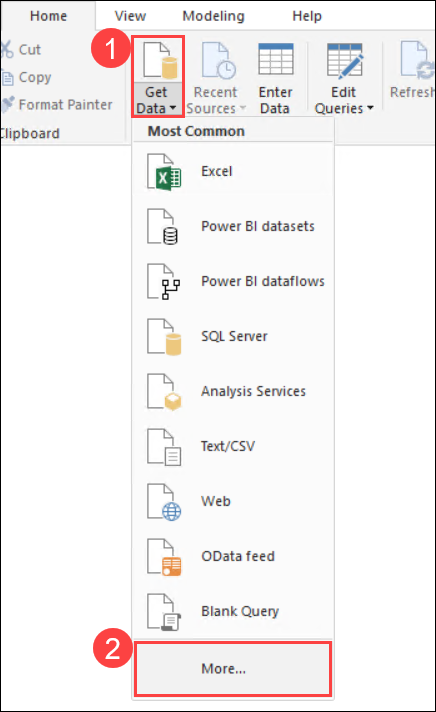

## **Lab 7: Dashboarding on Hyperscale (Citus) using Power BI**

You can use Power BI to analyze and visualize your PostgreSQL data. Using Power BI, you get the ability to centralize your data, simplify it with queries you create, and share it in highly visual reports. Power BI has both direct query and import support for PostgreSQL i.e either you can generate reports that directly run queries/aggregates on the database or by pulling and caching data in Power BI. These functionalities should work with both Single Server and Hyperscal (Citus) options of Azure Database for PostgreSQL.
 
In real-time analytics workloads, you can use Power BI to query both rollup tables and raw tables in Hyperscale (Citus). With larger datasets you could use the direct query functionality for better scalability. Because of sharding and parallelism across multiple nodes dashboard queries would be super snappy. For smaller datasets you could use the import functionality to create reports. Along with performance, Hyperscale (Citus) also lets you have large number of users concurrently running reports in Power BI.
 
In this exercise, you will connect to your PostgreSQL database cluster in Power BI Desktop and view/create advanced visualizations:

1.Open **PowerBI** given in left side on the desktop.

2.Now click on **Sign in** button in the top right corner of PowerBI. Provide your Azure credentials i.e. **Username** and **Password** to successfully sign in.

3.Select **Get Data** under **View**, then click on **More**.

4.A **Get Data** block will appear. Select **Database** > **PostgreSQL database** and then **Connect**.

5.Now connect to you database by providing your **Server name** and **Database name**. For **Data Connectivity Mode** select **Direct query**. Then select **Ok**.

6.Now in the **Navigator** select **public.http_request_1min** table given under the server and select **Load**.

7.Then in the right of PowerBI, under **Fields** you can review the table you selected in the previous step.

8.Now select **Clustered Coloumn Chart** as shown below. Then drag **site_id** under **Axis**.

9.Now drag **error_count**, **request_count** and **success_count** under **Value** as shown below:

10.Now add filter by dragging **ingest_time** under **Filters on this page**.

11.It will look like as shown below. Then select **Filter Type** as **Basic Filtering** from the dropdown.

12.Now select a randome ingest time as shown below.

13.The final graph will look similar to the one shown below.

14 **PLACE HOLDER**
